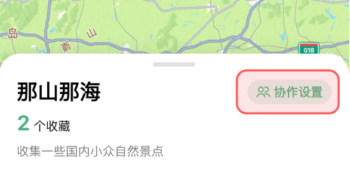

# 与朋友一起协作收藏
漫游家的收藏夹支持多用户共享协作，方便您与朋友之间共同维护地点信息。

## 开启协作收藏

如果您是本收藏夹的创建者，您可以点击地点列表头部的【协作设置】按钮。

然后打开协作开关。

 

这样您的收藏夹就可以被分享的朋友查看和加入协作了。

 

您也可以在收藏夹详情页面点击右上方的分享按钮并在弹窗内生成分享链接，生成链接后默认打开协作开关，加入协作的人可以查看您分享的内容。

## 分享收藏夹

如果您是本收藏夹的创建者，您可以选择在收藏夹详情页面点击右上方的分享按钮并在弹窗内生成分享链接，将收藏夹通过多种方式分享给您的朋友。

 

您也可以选择通过生成邀请码的方式分享给朋友，后续朋友可以使用邀请码进行加入您分享的协作收藏夹。
 如果您不希望他人继续通过此邀请码加入协作收藏，可以在此页面选择【隐藏】或【刷新】邀请码。

## 加入收藏协作

您也可以选择通过输入邀请码的方式加入协作收藏。

 

如果您是在浏览器网页中打开的分享链接，则可以通过页面上的提示信息在 App 内打开此分享的收藏夹，后续会自动识别此收藏夹并输入邀请码等待下一步操作。

