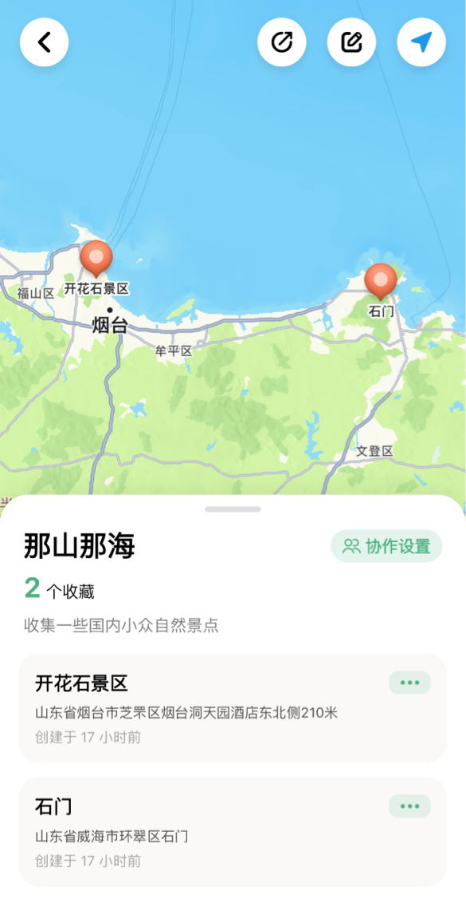

# 收藏夹操作

关于收藏夹的创建、编辑、与使用。

## 创建

在添加地点时可以选择创建收藏夹。

 

您也可以在首页收藏夹列表的末端进入收藏夹管理页面进行创建操作。

## 编辑

首页单次点击收藏夹名称切换到该收藏夹，再次点击该收藏夹名称可以快速进入收藏夹详情。
或如上一条所说，点击页收藏夹列表的末端进入收藏夹管理页面进行编辑操作。

 

## 收藏夹详情

点击右上角的编辑按钮即可进入编辑页面；您可以在此进行收藏夹的信息修改。

## 删除

在收藏夹编辑页面您可以在右上角找到删除按钮进行删除操作。
 请注意，删除收藏夹将会删除本收藏夹及所有的已收藏内容，删除后不可恢复，请谨慎操作。

