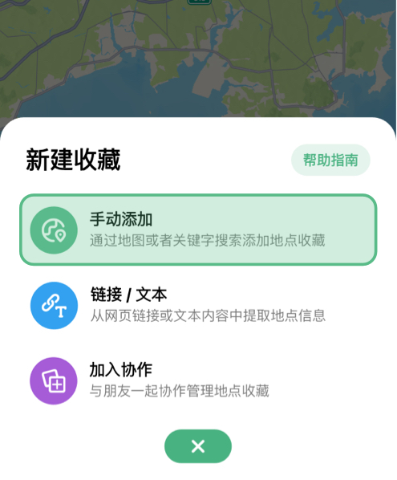
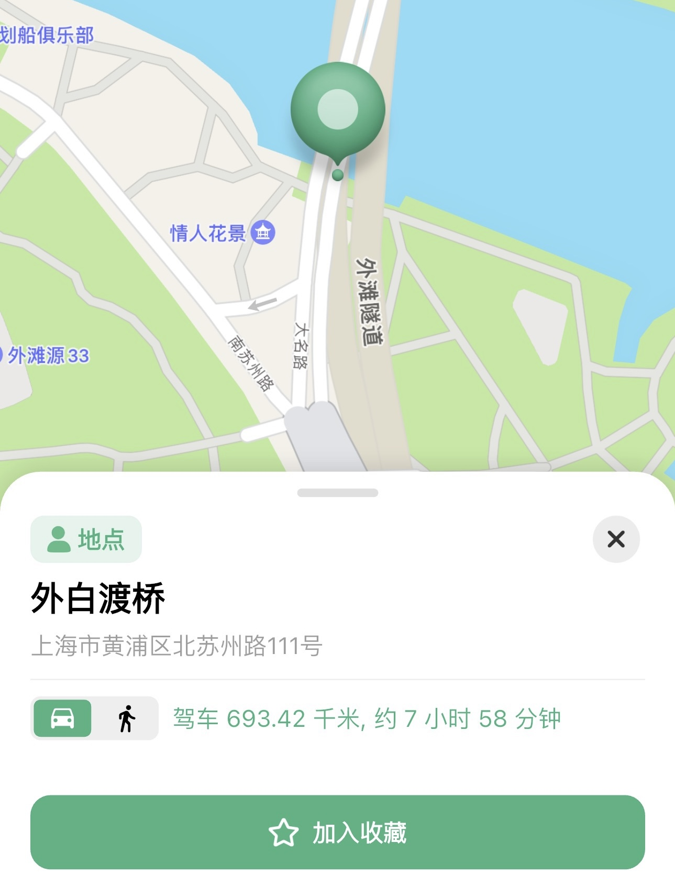
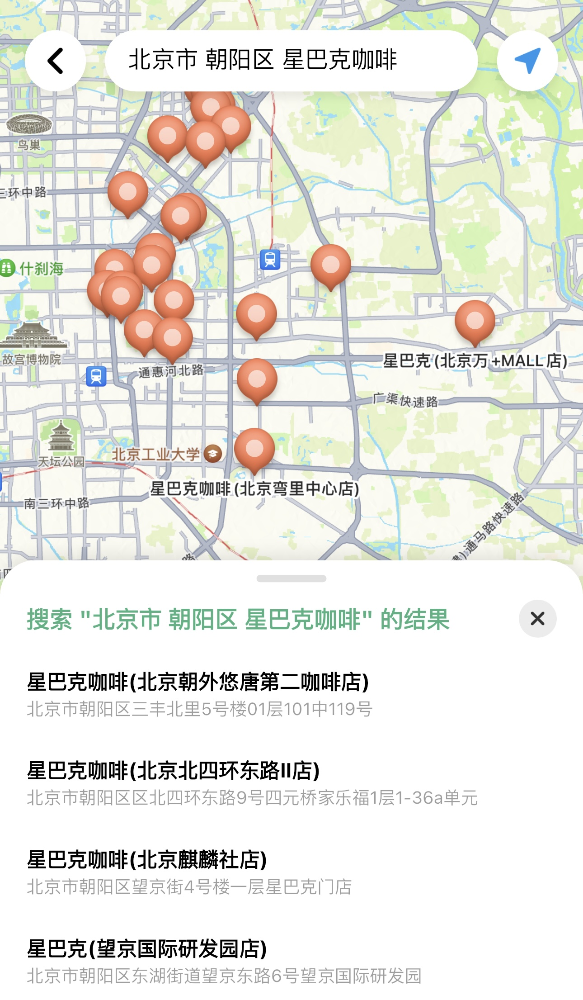

# 手动添加
#### 首页 → ➕ 号按钮 → 手动添加

## 📍 通过点选获取地址信息

直接点击地图上你感兴趣的位置，即选择加入收藏。

## 🔍 关键字搜索

点击搜索栏或者下方的搜索按钮即可呼出键盘，输入内容后进行搜索，根据搜索结果选择加入收藏。

💡 Tips: 搜索地点时最好带上你想要搜索地点所在的行政区域信息，如“上海市 外白渡桥”、“北京市 朝阳区 星巴克咖啡”等。

