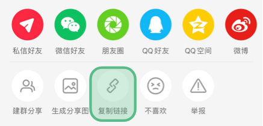
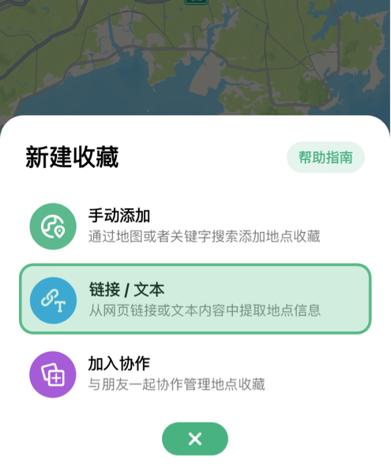
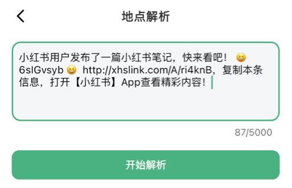
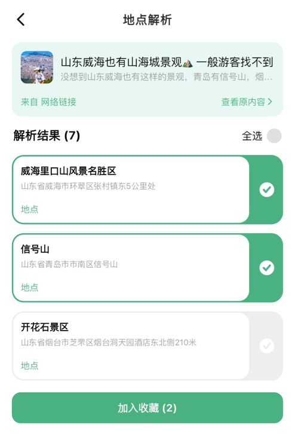

# AI 解析
漫游家支持常用平台的链接内容解析: “小红书”、“大众点评”、“微信公众号”、“高德地图分享”。同样支持含有地理位置信息的【文本材料】的自动识别与解析。

后续将支持更多平台内容的地点解析。

## 链接解析

#### 应用场景
 

小红书是一个非常优秀的 UGC 社交平台，里面有无数优秀用户的地点推荐帖子，当我们浏览一篇非常感兴趣的地点推荐帖时，您可以在小红书 App 分享功能里复制本条内容的链接，粘贴到漫游家进行地点内容解析。

#### 1. 复制内容链接（如小红书分享链接，其它支持的平台同理）；

#### 2. 打开漫游家 App → 首页 → ➕ 号按钮；

#### 3. 输入链接, 如复制的小红书链接分享内容/纯链接；

#### 4. 点击解析按钮等待结果；

#### 5. 根据您需要的内容添加到个人地点收藏即可。

## 文本解析

同上述小红书链接解析一样，复制您包含地点信息的文本，粘贴到输入框即可开始解析。

